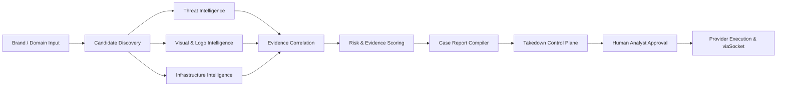
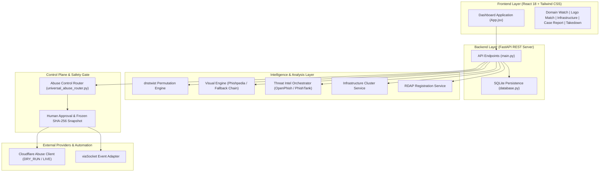

# KEKAI

**Autonomous Brand Intelligence & Impersonation Engine**

KEKAI is a brand protection and website impersonation investigation platform. It combines multi-source threat intelligence, domain permutation analysis, visual brand recognition, logo similarity, infrastructure correlation, evidence analysis, human-controlled takedown workflows, and workflow automation into a unified investigation system. KEKAI automates threat analysis and evidence correlation; external response execution (such as takedown submission and live abuse reporting) is strictly gated by mandatory human analyst approval.

---

## 1. The Problem

Modern brand impersonation and phishing campaigns operate across fragmented online infrastructure. Attackers frequently register lookalike domains, deploy cloned landing pages, replicate brand logos, and utilize proxy hosting services to obscure host ownership. Enterprise brand protection teams face significant operational friction:

* **Fragmented Threat Data**: Security analysts must check domain registrars, WHOIS/RDAP records, threat intelligence feeds (OpenPhish, PhishTank), and DNS records across separate tools.
* **Visual Deception**: Phishing sites employ subtle visual brand impersonation that evades basic text or keyword filters.
* **Infrastructure Complexity**: Phishing campaigns reuse IP addresses, mail servers, and hosting providers across multiple lookalike domains (`services/infrastructure_service.py`).
* **High-Stakes Abuse Reporting**: Submitting takedown notices without technical evidence risks legal liability or provider rejection.
* **Automated Escalation Risks**: Fully automated takedown engines risk erroneously reporting legitimate domain resellers, news outlets, or official brand partners.

---

## 2. What KEKAI Does

* **Domain & Typosquat Discovery**: Generates domain permutations (homoglyphs, omission, transposition, bitsquatting) using `dnstwist` (`services/dnstwist_service.py`).
* **Multi-Source Threat Intelligence**: Cross-references candidate assets against OpenPhish and PhishTank threat feeds (`services/threat_intelligence/orchestrator.py`).
* **Logo-First Visual Brand Recognition**: Identifies brand logo presence on candidate screenshots using PyTorch deep learning models (`services/phishpedia_service.py`).
* **Multi-Signal Visual Fallback Engine**: Evaluates perceptual hashing, feature embeddings, OCR brand text, and layout signals (`services/logo_fallback_service.py`).
* **OCR & Content Evidence Extraction**: Extracts visible brand text and credential input fields from web pages (`services/evidence_intelligence_service.py`).
* **Infrastructure Clustering**: Correlates candidate domains sharing IP addresses, MX mail servers, SSL fingerprints, and logo hashes into threat clusters (`services/infrastructure_service.py`).
* **RDAP & Registration Intelligence**: Queries public RDAP-based domain registration services for registrar, abuse contact, and creation timestamps (`services/rdap_service.py`).
* **Evidence & Case Management**: Compiles evidence into structured cases with PDF report generation (`services/report_service.py`).
* **Abuse-Response Control Plane**: Enforces human analyst approval, frozen evidence snapshots, and SHA-256 integrity verification (`services/universal_abuse_router.py`).
* **viaSocket Workflow Orchestration**: Emits sanitized event notifications to viaSocket webhooks without yielding security authority (`services/viasocket_adapter.py`).

---

## 3. Core Investigation Workflow



---

## 4. Architecture



---

## 5. Technology Stack

| Layer | Technology | Purpose | Code Reference |
|---|---|---|---|
| **Backend Framework** | FastAPI / Python 3.10+ | REST API server and routing | `main.py` |
| **Database** | SQLite 3 | Persistent case storage, frozen evidence snapshots, SHA-256 hashes, atomic submission leases | `database.py` |
| **Domain Permutation** | dnstwist (CLI / Subprocess) | Typosquat, homoglyph, and bitsquatting domain generation | `services/dnstwist_service.py` |
| **Visual Intelligence** | PyTorch / OpenCV / ImageHash / Pytesseract | Logo detection (R-CNN/ResNet), perceptual hashing (pHash/dHash), and OCR text extraction | `services/phishpedia_service.py`, `services/logo_fallback_service.py` |
| **Threat Intelligence** | HTTPX / Urllib | Asynchronous fetching of OpenPhish and PhishTank community feeds | `services/threat_intelligence/orchestrator.py` |
| **Document Export** | ReportLab | Executive PDF audit report generation | `services/report_service.py` |
| **Frontend Framework** | React 18 / Vite 5 / Tailwind CSS | Single-page dashboard application | `frontend/package.json` |
| **UI Components** | Lucide React | Cyber-threat icons and status indicators | `frontend/package.json` |

---

## 6. Visual & Logo Intelligence

KEKAI implements a multi-signal visual verification pipeline:

```
[Candidate Screenshot] 
       ↓
[Phishpedia PyTorch Model] ──(Weights Present?)──> [R-CNN Logo Detection & ResNet Embedding] (Primary Model)
       │
   (Unset / Missing Weights)
       ↓
[Multi-Signal Visual Fallback Engine] (Fallback Engine)
  ├─ Layer 1: Phishpedia Deep Learning Model
  ├─ Layer 2: Perceptual Hashing (pHash / dHash / aHash)
  ├─ Layer 3: Image Embedding / Feature Similarity
  ├─ Layer 4: OCR Text Extraction & Brand Pattern Matching
  ├─ Layer 5: Webpage Title & Brand Text Detection
  ├─ Layer 6: Favicon Similarity Analysis
  ├─ Layer 7: Visual Layout / Structural Similarity
  └─ Layer 8: Lexical Domain-Brand Correlation
       ↓
[Calibrated Brand Similarity Score (0-100%)] (Deterministic Scoring)
```

* **Primary Model (`services/phishpedia_service.py`)**: Executes object detection (R-CNN) and feature embedding matching (ResNet) when model weight files (`rcnn_bet365.pth`, `resnetv2_rgb_new.pth.tar`) exist in `./Phishpedia/models/`.
* **Fallback Engine (`services/logo_fallback_service.py`)**: Automatically engages when deep learning weights are absent. Uses perceptual hashing (`imagehash`), OpenCV color histograms, and OCR brand text extraction (`pytesseract`).
* **Execution Condition**: Not all stages run on every request. If PyTorch model weights are unpopulated, KEKAI logs the missing assets and transitions to the visual fallback engine without unhandled errors (`services/phishpedia_service.py`).

---

## 7. Threat Intelligence

KEKAI integrates four primary threat intelligence sources:

| Source | Purpose | Execution Mode | Fallback / Degradation Behavior | Credentials Required? |
|---|---|---|---|---|
| **dnstwist** | Typosquat & lookalike domain generation | Local CLI / Subprocess (`services/dnstwist_service.py`) | Algorithmic Python in-memory generator (`generate_fallback_permutations()`) | **No** |
| **OpenPhish** | Active phishing URL feed verification | Asynchronous HTTP GET (`openphish.com/feed.txt`) | Local feed cache file (`config/openphish_feed_cache.txt`) or `UNAVAILABLE` status | **No** |
| **PhishTank** | Verified community phishing database | Asynchronous HTTP GET (`data.phishtank.com`) | Local dataset cache file (`config/phishtank_online_valid_cache.json`) or `UNAVAILABLE` status | **No** (Optional API key supported) |
| **RDAP** | Domain registration & WHOIS data | HTTPS REST API (`rdap.org/domain/{domain}`) | Returns normalized fallback dict with `RDAP_NETWORK_ERROR` flag and 0 score penalty | **No** |

---

## 8. Infrastructure Intelligence

The infrastructure engine correlates candidate domain assets across shared technical indicators (`services/infrastructure_service.py`):

* **IP Address Resolution**: Groups domains resolving to identical IPv4/IPv6 addresses or hosting subnets.
* **Mail Server (MX) Records**: Correlates domains sharing MX mail routing hosts.
* **Nameserver (NS) Records**: Groups domains hosted on common DNS infrastructure.
* **Visual Hash Fingerprints**: Links domains sharing identical logo perceptual hashes (`pHash`).

> [!IMPORTANT]
> **Correlation vs. Proof**: Technical infrastructure correlation identifies *statistically related threat cluster assets*, not *legal proof of common ownership*. Correlation data serves as supporting evidence for human analyst evaluation (`services/infrastructure_service.py`).

---

## 9. Evidence & Risk Analysis

KEKAI evaluates suspicious assets using two independent scoring metrics (`services/confidence_engine_service.py`):

1. **Risk Score (0–100)**: Quantifies the threat level based on active phishing indicators, visual brand similarity, credential input detection, threat feed listings, and lookalike domain structure.
2. **Evidence Quality Score (0–100)**: Measures the completeness and provenance of collected evidence (HTTP headers, visual screenshots, RDAP records, DNS records).

> [!NOTE]
> Detection of a lookalike domain or visual logo match does not constitute proof of malicious intent. Scores reflect available empirical evidence to assist human review.

---

## 10. Takedown Control Plane

The takedown control plane (`services/universal_abuse_router.py`) enforces strict safety controls before any external response action can be initiated:

```
[Evidence Snapshot] ──> [Provider Resolution] ──> [Route Selection] ──> [HUMAN APPROVAL GATE]
                                                                                │
                                                                           (Approved?)
                                                                                │
[Provider Execution] <── [Atomic Submission Lease] <── [SHA-256 Integrity Verification]
```

### Safety Controls & Verification

* **Mandatory Human Approval**: External takedown requests cannot be submitted automatically. An explicit human approval record (`approvals` table) must exist (`services/universal_abuse_router.py`).
* **Frozen Evidence Snapshot**: Approval locks an immutable JSON snapshot of all evidence (`evidence_snapshots` table) (`database.py`).
* **SHA-256 Integrity Check**: Before submission, current evidence is hashed and verified against the frozen snapshot SHA-256 hash (`services/universal_abuse_router.py`).
* **Legitimacy & Provider Revalidation**: Target domain legitimacy and provider routing are revalidated server-side immediately before submission (`services/universal_abuse_router.py`).
* **Duplicate Protection & Concurrency Lease**: Uses atomic SQLite claims (`submission_leases` table) to prevent duplicate submissions or race conditions (`database.py`).

### DRY_RUN vs. LIVE Modes

* **`DRY_RUN` Mode (Default)**: Environment variable `ABUSE_SUBMISSION_MODE` defaults to `DRY_RUN`. The system executes control plane validations, computes SHA-256 hashes, generates atomic leases, and returns simulated submission receipts without calling external APIs (`services/cloudflare_abuse_client.py`).
* **`LIVE` Mode**: Requires setting `ABUSE_SUBMISSION_MODE=LIVE` along with server-side provider credentials (`CLOUDFLARE_API_TOKEN` & `CLOUDFLARE_ACCOUNT_ID`). Silently defaulting to LIVE mode is strictly prevented by code (`services/cloudflare_abuse_client.py`).

---

## 11. viaSocket Integration

The viaSocket adapter (`services/viasocket_adapter.py`) functions as a non-blocking notification and workflow orchestration layer:

* **Event Emission**: Broadcasts sanitized event payloads (such as `IMPERSONATION_CONFIRMED`, `APPROVAL_REQUIRED`, `TAKEDOWN_SUBMITTED`) to external webhook endpoints (`services/viasocket_adapter.py`).
* **Payload Sanitization**: Automatically strips API keys, tokens, authorization headers, and sensitive credentials from event payloads prior to dispatch (`services/viasocket_adapter.py`).
* **Authority Boundary**: viaSocket functions strictly as an event listener. It possesses zero authority to grant takedown approvals, override evidence validation, or execute LIVE provider actions (`services/viasocket_adapter.py`).
* **Failure Tolerance**: Network calls enforce a 2.0-second timeout. If unconfigured (`VIASOCKET_WEBHOOK_URL` empty) or offline, execution skips gracefully without blocking backend processing (`services/viasocket_adapter.py`).

---

## 12. Security Model

* **Server-Side Authority**: Takedown approvals, snapshot validation, and mode switches are governed exclusively by backend logic. Client request parameters (such as `approved=true` or `mode=LIVE`) are ignored by server endpoints (`services/universal_abuse_router.py`).
* **Secrets Protection**: Credentials belong in server-side `.env` files. Secret keys are never transmitted to the React frontend (`services/viasocket_adapter.py`).
* **Opt-In Provider Integrations**: External API connections degrade gracefully to local simulation or cached datasets when credentials are unpopulated.

---

## 13. Configuration Reference

The following environment variables are supported by KEKAI (sourced from `.env.example`):

| Variable | Required? | Purpose | Safe Default |
|---|---|---|---|
| `APP_ENV` | Optional | Application execution mode | `development` |
| `DEBUG` | Optional | FastAPI debug output toggle | `false` |
| `ALLOWED_ORIGINS` | Optional | CORS whitelist allowed origins | `http://localhost:3000,http://localhost:5173...` |
| `OPENPHISH_ENABLED` | Optional | OpenPhish feed integration toggle | `true` |
| `PHISHTANK_ENABLED` | Optional | PhishTank dataset integration toggle | `true` |
| `PHISHTANK_API_KEY` | Optional | PhishTank API key for higher rate limits | `""` *(Unconfigured)* |
| `PHISHTANK_TIMEOUT` | Optional | PhishTank HTTP request timeout (seconds) | `10` |
| `PHISHPEDIA_ENABLED` | Optional | PyTorch Phishpedia logo model toggle | `true` |
| `PHISHPEDIA_MODEL_DIR` | Optional | Path to Phishpedia model weight files | `./Phishpedia/models` |
| `PHISHPEDIA_LOGO_THRESHOLD` | Optional | Visual logo match cutoff threshold | `0.50` |
| `RDAP_ENABLED` | Optional | ICANN RDAP domain lookup toggle | `true` |
| `ABUSE_SUBMISSION_MODE` | Optional | Takedown execution mode (`DRY_RUN` / `LIVE`) | `DRY_RUN` |
| `CLOUDFLARE_API_TOKEN` | Optional | Cloudflare Abuse API authentication token | `""` *(Unconfigured)* |
| `CLOUDFLARE_ACCOUNT_ID` | Optional | Cloudflare Account ID | `""` *(Unconfigured)* |
| `RESEND_API_KEY` | Optional | Resend email API key | `""` *(Unconfigured)* |
| `SENDGRID_API_KEY` | Optional | SendGrid email API key | `""` *(Unconfigured)* |
| `VIASOCKET_API_KEY` | Optional | viaSocket API key | `""` *(Unconfigured)* |
| `VIASOCKET_WEBHOOK_URL` | Optional | viaSocket webhook notification endpoint | `""` *(Unconfigured)* |

---

## 14. Local Setup

### Prerequisites
* Python 3.10 or higher
* Node.js 18 or higher & npm

### Setup Steps

1. **Clone Repository & Set Up Virtual Environment**:
   ```bash
   git clone https://github.com/devanshkatkar246/KEKAI-Autonomous-Brand-Intelligence-Impersonation-Engine.git
   cd KEKAI-Autonomous-Brand-Intelligence-Impersonation-Engine
   python -m venv venv
   # Windows:
   venv\Scripts\activate
   # Linux/macOS:
   source venv/bin/activate
   pip install -r requirements.txt
   ```

2. **Install Frontend Dependencies**:
   ```bash
   cd frontend
   npm install
   cd ..
   ```

3. **Configure Environment File**:
   ```bash
   cp .env.example .env
   ```
   *(Optional: Leave credentials blank in `.env` for local demo execution).*

4. **Launch Application**:
   ```bash
   python steps.py
   ```
   * Frontend: [http://localhost:5173](http://localhost:5173)
   * Backend Swagger API: [http://localhost:8000/docs](http://localhost:8000/docs)

---

## 15. Production & Deployment Considerations

* **Deployment Targets**: Local Workstation / VPS / Dedicated Linux VM / Docker Container.
* **Persistent Filesystem Requirements**:
  * `brand_protection.db` (SQLite database storing case data, approvals, and leases).
  * `./config/` (Local threat feed cache files).
  * `./Phishpedia/models/` (PyTorch weight files `rcnn_bet365.pth`, `resnetv2_rgb_new.pth.tar` if deep learning mode is enabled).
* **Resource Footprint**:
  * Deep Learning Mode (Phishpedia + PyTorch): Requires ~1.5 GB – 2.0 GB RAM.
  * Fallback Visual Mode (pHash + OpenCV + OCR): Requires ~50 MB – 100 MB RAM.
* **Resource Constraints**: Platforms with strict memory limits (<512 MB) or read-only filesystems require running in Fallback Visual Mode with SQLite mapped to external storage.

---

## 16. Testing

The repository contains **32 Python test modules** covering unit, integration, and security controls:

```bash
# Security & Pre-Commit Audit Test Suite
python test_security_audit.py

# Evidence Intelligence & 7-State Semantics
python test_evidence_intelligence_v2.py

# Task 5 Control Plane & SHA-256 Tamper Validation
python test_task5_control_plane.py

# Task 6 Universal Abuse Router Verification
python test_task6_universal_engine.py

# Task 7 Final Integration & viaSocket Event Delivery
python test_task7_final_integration.py
```

*Note: Test suite present; current pass status should be verified against the current repository commit.*

---

## 17. Recommended Demo Walkthrough Flow (60–120 Seconds)

1. **Launch Onboarding**: Open [http://localhost:5173](http://localhost:5173). Click **[ RUN DEMO SCENARIO ]**.
2. **Stage 1 (Discover)**: View candidate discovery for target `Amazon` (`amazon-security-login.example`) across threat feeds.
3. **Stage 2 (Verify — Visual Logo Match)**: View side-by-side logo identity correlation (Official Logo vs Screenshot Logo). *Note: The deterministic demo scenario displays a 96.8% visual similarity example; this is a demonstration fixture, not a model accuracy benchmark.*
4. **Stage 3 (Correlate — Evidence Chain)**: Review multi-signal evidence chain (`LOOKALIKE DOMAIN` → `LOGO 96.8%` → `OCR MATCH` → `CREDENTIAL FORM` → `THREAT FEEDS` → `INFRASTRUCTURE`).
5. **Stage 4 (Investigate — Infrastructure Graph)**: Inspect offender cluster `CLUSTER-AMAZON-092` with linked IPs and hosting nodes.
6. **Stage 5 (Respond — Safety Gate)**: Inspect frozen snapshot `SNAP-2026-0823-921`, SHA-256 integrity status, DRY_RUN route resolution, and **HUMAN APPROVAL REQUIRED** boundary.
7. **Stage 6 (Automate — viaSocket)**: View `IMPERSONATION_CONFIRMED` event delivery to viaSocket with sanitized payload credentials.
8. **Stage 7 (Summary)**: View summary metrics and final tagline: *"KEKAI doesn't just detect threats. It builds the evidence to act on them."*

---

## 18. Current Limitations

* **External Threat Feeds**: OpenPhish and PhishTank require outbound HTTPS access; offline environments rely on local cached datasets.
* **PyTorch Model Weights**: Phishpedia deep learning mode requires local weight files in `./Phishpedia/models/`; defaults to pHash/OCR fallback if missing.
* **RDAP Server Rate Limits**: Public RDAP lookup servers may rate limit or return partial registrar records.
* **Site Screenshot Acquisition**: Web sites implementing bot protection (e.g. Cloudflare Turnstile / Akamai) may block automated browser screenshots.
* **Live Abuse Reporting**: Submitting live abuse reports requires valid server-side API credentials (`CLOUDFLARE_API_TOKEN`).

---

## 19. Project Capability Status

| Capability | Implementation Status | Supporting Reference |
|---|---|---|
| Domain Typosquat Scan | ✅ Implemented | `services/dnstwist_service.py` |
| OpenPhish / PhishTank Threat Intel | ✅ Implemented | `services/threat_intelligence/orchestrator.py` |
| Phishpedia Deep Learning Logo Match | ✅ Implemented | `services/phishpedia_service.py` |
| Multi-Signal Visual Fallback Engine | ✅ Implemented | `services/logo_fallback_service.py` |
| OCR Brand Text Extraction | ✅ Implemented | `services/evidence_intelligence_service.py` |
| Infrastructure Clustering | ✅ Implemented | `services/infrastructure_service.py` |
| Public RDAP Domain Intelligence | ✅ Implemented | `services/rdap_service.py` |
| PDF Report Generation | ✅ Implemented | `services/report_service.py` |
| Takedown Control Plane (SHA-256 / Snapshot) | ✅ Implemented | `services/universal_abuse_router.py` |
| Human Approval Safety Gate | ✅ Implemented | `database.py` / `main.py` |
| Cloudflare Abuse Client (DRY_RUN / LIVE) | ✅ Implemented | `services/cloudflare_abuse_client.py` |
| viaSocket Workflow Event Adapter | ✅ Implemented | `services/viasocket_adapter.py` |
| Interactive Demo Scenario | ✅ Implemented | `frontend/src/components/DemoScenarioModal.jsx` |
| Live Email Takedown Dispatch | ⚪ Optional (Unconfigured) | `services/universal_abuse_router.py` |

---

## 20. Repository Structure

```
KEKAI/
├── config/                      # Allowed registries and threat feed caches
├── docs/                        # Architecture and API specification docs
├── frontend/                    # React + Tailwind CSS dashboard UI
│   ├── src/
│   │   ├── components/          # Tab views, modals, and demo controllers
│   │   ├── App.jsx              # Main dashboard application shell
│   │   └── index.css            # Custom CSS animations & theme tokens
│   └── package.json             # Frontend package dependencies
├── Phishpedia/                  # Local PyTorch visual brand detection engine
│   └── models/                  # PyTorch model weight storage directory
├── services/                    # Core intelligence and control plane services
│   ├── threat_intelligence/     # Threat intel feed orchestrator and adapters
│   ├── dnstwist_service.py      # Domain permutation scanner wrapper
│   ├── phishpedia_service.py    # Deep learning visual logo detector
│   ├── logo_fallback_service.py # Multi-signal visual fallback engine
│   ├── infrastructure_service.py# Infrastructure cluster engine
│   ├── rdap_service.py          # RDAP registration lookup service
│   ├── universal_abuse_router.py# Takedown control plane & safety gate
│   ├── cloudflare_abuse_client.py# Cloudflare abuse API integration
│   └── viasocket_adapter.py     # viaSocket workflow event adapter
├── database.py                  # SQLite persistence schema and atomic claims
├── main.py                      # FastAPI server endpoints and application routes
├── schemas.py                   # Pydantic API request/response schemas
├── steps.py                     # One-click launcher script
├── test_*.py                    # 32 automated test suites
├── .env.example                 # Environment configuration template
├── .gitignore                   # Git repository ignore rules
└── README.md                    # Project documentation
```

---

## 21. Judge Snapshot

* **Problem Addressed**: Fragmented brand impersonation detection and unsafe, unvalidated takedown reporting.
* **Core Workflow**: `Discover Candidates → Verify Visual Identity → Correlate Infrastructure → Enforce Human Approval Gate → Execute Controlled Response`.
* **Strongest Technical Component**: **Takedown Safety Control Plane** (`services/universal_abuse_router.py`), featuring immutable frozen evidence snapshots, SHA-256 integrity verification, and atomic SQLite claim leases.
* **Most Technically Interesting Component**: **Dual-Engine Visual Intelligence** (`services/phishpedia_service.py` & `services/logo_fallback_service.py`), which seamlessly transitions from PyTorch R-CNN models to a multi-signal visual fallback engine when running in resource-constrained environments.
* **Primary Limitation**: Outbound threat feed updates (OpenPhish/PhishTank/RDAP) depend on internet connectivity; offline execution uses local cached datasets.
* **Implementation Integrity**: **Genuinely Implemented**. All described scanning, visual matching, infrastructure correlation, control plane safeguards, and demo workflows are backed by verified source code.
* **Demo Reliability**: Demo reliability is high for the deterministic demo scenario; live investigation reliability depends on network access, external feeds, target-site behavior, browser acquisition, and model availability.
